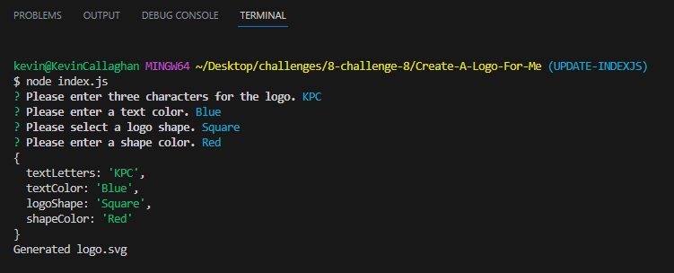
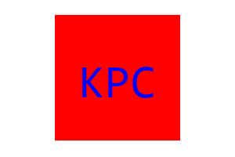
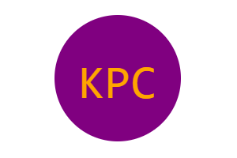
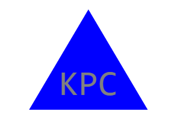
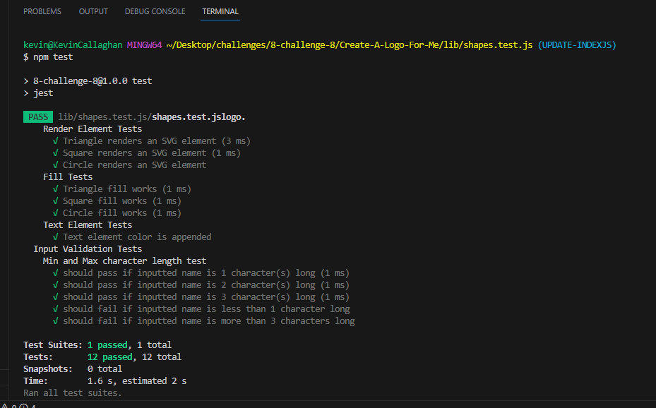

# Create-A-Logo-For-Me by Kevin Callaghan

## Description

This project is designed for a user to quickly create a custom logo for their own project.  The user can choose their own letters, shape, and colors, then have a SVG file of their logo generated for them.  During this project I learned about linking multiple javascript files, using jest to test, and how to use the inquirer validate features.

## Table of Contents (Optional)

- [Installation](#installation)
- [Usage](#usage)
- [Credits](#credits)
- [License](#license)
- [Tests](#tests)

## Installation

To use this project, you must install inquirer.  To test this project, you must install jest.

## Usage

Here is a link to the walkthrough video: https://watch.screencastify.com/v/K1titH5cRZHPuCGyjagR 

To use this project, open the terminal on the index.js file and type "node index.js" and hit enter to start.  From here, you will enter the characters you want to include in the logo (1-3 characters), the character color in either text or hexadecimal format, the shape you would like your logo to appear as, and the color you would like the shape to be.  After you have answered all of the questions prompted to you in the terminal, a SVG file of your custom logo will be generated in the "examples" folder.

Here is an example of the prompts in the terminal:

Here are samples of a circle, square, and triangle logo created using this project:
    

## Credits

1. Node gitIgnore template was found on https://github.com/github/gitignore 

2. I learned that you could validate a prompt field inside the Inquirer array from a Stack Overflow article.  Here is a link to the article: https://stackoverflow.com/questions/65189877/how-can-i-validate-that-a-user-input-their-email-when-using-inquirer-npm 

3. This website was very helpful with creating the SVG logo area, circle shape, and text code.  Here is a link to the page: https://developer.mozilla.org/en-US/docs/Web/SVG/Tutorial/Getting_Started 

4. The article "SVG Shape Elements: Polygons" on thenewcode.com had starter code that I copied and changed to make my triangle SVG shape.  Here is a link to the page:  http://thenewcode.com/1037/SVG-Shape-Elements-Polygons 

5.  The article "SVG Shape Elements: Rectangles and Squares" on thenewcode.com had starter code that I copied and changed to make my square SVG shape.  Here is a link to the page:  http://thenewcode.com/1034/SVG-Shape-Elements-Rectangles-and-Squares 

6. I watched the video "JavaScript Constructors" on Bro Code youtube channel to learn more and help with my Class Constructor for Shape.  Here is the link to the video: https://www.youtube.com/watch?v=DaUFyK8M4WY 

7. I created an if/else to validate my input for 3 letters using ternary code that I found similar examples of on javascripttutorial.net.  Here is a link to the page: https://www.javascripttutorial.net/javascript-ternary-operator/ 

8. I found two separate questions relating to validating a color and validating text on Stack Overflow with answers that helped me come up with how I validated the color input in my Inquirer prompt for Text and Shape color.  Here are links to the pages:
Validating Color: https://stackoverflow.com/questions/2819619/validating-html-color-codes-js 
Validating Text: https://stackoverflow.com/questions/69699749/validate-text-with-javascript-regex 

9. I found a method of validating an inquirer prompt and then testing the inquirer prompt with JEST on Stack Overflow on a page titled, "Unit Testing Inquirer with Jest" in an answer from user Scott Blanch.  I used this to change how I was validating the character count and how I tested if it worked.  Here is a link to that page: https://stackoverflow.com/questions/53463776/unit-testing-inquirer-with-jest 

## License

MIT License.

Please refer to the LICENSE document in the repository for additional License Information.

## Tests

To test this project, you will open the terminal on the shapes.test.js file and type "npm test" and hit enter.  From here, jest will run through the tests and display the results in the terminal.

Here is an example of the tests in the terminal:

